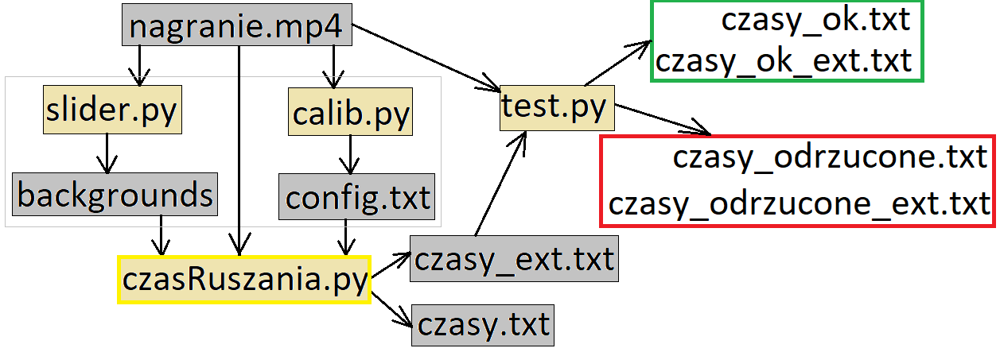

# Pomiar czasu reakcji kierowców na podstawie nagrania

## Spis treści
* [Cel projektu](#cel-projektu)
* [Technologie](#technologie)
* [Uruchomienie oprogramowania](#uruchomienie-oprogramowania)
* [TODO](#todo)
* [Bibliografia](#bibliografia)

## Cel projektu
Projekt zrealizowałem w trakcie studiów w ramach publikacji "Communication management to improve the efficiency of intelligent transport systems". Celem projektu było stworzenie oprogramowania do pomiaru czasów reakcji kierowców na podstawie nagrania ze skrzyżowania w Warszawie.

## Technologie
* Python 3
* OpenCV 2

## Uruchomienie oprogramowania
Najpierw należy ustawić parametry, które są ustawiane ręcznie, w pliku konfiguracyjnym config.json. Aby dokończyć konfugigurację trzeba wydobyć tła(program [slider.py](https://github.com/robert-czwartosz/czas-ruszania/blob/main/slider.py)) oraz dokonać kalibracji za pomocą programu [calib.py](https://github.com/robert-czwartosz/czas-ruszania/blob/main/calib.py). Pomiary są dokonywane przez program [czasRuszania.py](https://github.com/robert-czwartosz/czas-ruszania/blob/main/czasRuszania.py). Po dokonaniu pomiarów należy odrzucić te, które zostały wykonane niewłaściwie, przy pomocy programu [test.py](https://github.com/robert-czwartosz/czas-ruszania/blob/main/test.py). Więcej informacji na temat zasady działania oprogramowania znajduje się w pliku [czasRuszania.pdf](https://github.com/robert-czwartosz/czas-ruszania/blob/main/czasRuszania.pdf).

### Plik konfiguracyjny [config.json](https://github.com/robert-czwartosz/czas-ruszania/blob/main/config.json)
* X, Y, W, H - parametry prostokąta, obejmującego analizowany obszar; X i Y są współrzędnymi lewego górnego rogu, natomiast W i H określają szerokość i wysokość; ustawiane przy pomocy [calib.py](https://github.com/robert-czwartosz/czas-ruszania/blob/main/calib.py)
* x1, y1, w1, h1 - parametry prostokąta, opisującego miejsce nr 1 (pojazd nr 1); ustawiane przy pomocy [calib.py](https://github.com/robert-czwartosz/czas-ruszania/blob/main/calib.py)
* x2, y2, w2, h2 - parametry prostokąta, opisującego miejsce nr 2 (pojazd nr 2); ustawiane przy pomocy [calib.py](https://github.com/robert-czwartosz/czas-ruszania/blob/main/calib.py)
* x3, y3, w3, h3 - parametry prostokąta, opisującego miejsce nr 3 (przejezdność skrzyżowania); ustawiane przy pomocy [calib.py](https://github.com/robert-czwartosz/czas-ruszania/blob/main/calib.py)

* threshRuch1 - próg określający czułość detekcji ruchu pierwszego pojazdu; zakres wartości: od 0 do 255; ustawiane ręcznie
* threshRuch1 - próg określający czułość detekcji ruchu drugiego pojazdu; zakres wartości: od 0 do 255; ustawiane ręcznie
* threshJest - próg określający czułość detekcji obecności pojazdów; zakres wartości: od 0 do 255; ustawiane ręcznie

* pathRoot - ścieżka do katalogu zawierającego nagranie; ustawiane ręcznie
* video - nazwa pliku z nagraniem; ustawiane ręcznie
* output - nazwa pliku zawierającego zmierzone czasy reakcji kierowców; ustawiane ręcznie

* show - określa czy pokazać obraz podczas działania programu czasRuszania.py; ustawiane ręcznie
* save - określa czy zapisać zmierzone czasy po zakończeniu działania programu czasRuszania.py; ustawiane ręcznie

### Wydobycie teł
Nagranie jest przeglądane za pomocą programu [slider.py](https://github.com/robert-czwartosz/czas-ruszania/blob/main/slider.py) w celu wydobycia odpowiedniej liczby teł. Zalecane jest, aby w tła były zapisywane co około pół godziny nagrania.

STEROWANIE
* n - 1s do przodu
* b - 1s do tyłu
* m - 7.5min do przodu
* v - 7.5min do tyłu
* , - 15 min do przodu
* c - 15 min do tyłu
* . - 30 min do przodu
* x - 30 min do tyłu
* / - 1h do przodu
* z - 1h do tyłu

* s - zapisz tło do katalogu backgrounds
* q - zakończ

### Kalibracja
Następnie wykonywana jest kalibracja, czyli ułożenie miejsc na odpowiednich pozycjach i określenie ich wymiarów. W tej czynności program [calib.py](https://github.com/robert-czwartosz/czas-ruszania/blob/main/calib.py) pełni funkcję pomocniczą.

Zmiana konfigurowanego pola odbywa się poprzez następujące klawisze:

* a - pole nr 1 - pojazd 1
* b - pole nr 2 - pojazd 2
* c - pole nr 3 - przejezdność skrzyżowania
* x - okno

Zmiana wybór czy zmieniana jest wysokość czy szerokość odbywa się poprzez klawisze:
* w - zmiana szerokości
* h - zmiana wysokości

Zmiana wymiarów i pozycji pól odbywa się poprzez:
* +/- - zwiększanie/zmniejszanie szerokości lub wysokości pola/okna
* 2, 8, 4, 6 - sterowanie pozycją

Pozostałe sterowania:
* s - zapisz
* q - zakończ

### Pomiary czasów reakcji
Po przygotowaniu teł i kalibracji uruchamiany jest skrypt [czasRuszania.py](https://github.com/robert-czwartosz/czas-ruszania/blob/main/czasRuszania.py). Ten skrypt mierzy czasy ruszania i odrzuca pomiary wykonane w złych warunkach np.: przesłonięcie przez  autobus lub korek. Nie zawsze program rozpoznaje czy pomiar wykonany był w odpowiednich warunkach. Zatem należy przejrzeć momenty wykonywania pomiarów. Zmierzone czasy są zapisywane do pliku **czasy.txt**. Natomiast czasy wraz z momentami rozpoczęcia i zakończenia pomiaru są zapisywane do pliku **czasy_ext.txt**.

STEROWANIE:

* z - tempo odtwarzania = 1
* x - tempo odtwarzania = 10
* c - tempo odtwarzania = 100
* v - zatrzymanie nagrania(tempo odtwarzania = 0)

* q - zakończ

### Przeglądanie pomiarów
Skrypt [test.py](https://github.com/robert-czwartosz/czas-ruszania/blob/main/test.py) pomaga użytkownikowi przeglądać klatka po klatce momenty wykonania pomiarów. Momentem wykonania pomiaru jest czas  Skrypt korzysta z plików **czasy_ext.txt** oraz **nagranie.mp4**. Jeśli pomiar był wykonany w odpowiednich warunkach użytkownik może zatwierdzić go klawiszem “A”, lub w przeciwnym razie odrzucić klawiszem “P”. Po przejrzeniu wszystkich pomiarów, wszystkie pomiary wykonane w odpowiednich warunkach są zapisywane do plików **czasy_ok.txt** oraz **czasy_ok_ext.txt**. Analogicznie postępuje się z odrzuconymi pomiarami.

STEROWANIE

n - 1 klatka do przodu
b - 1 klatka do tyłu

a - akceptacja pomiaru
p - odrzucenie pomiaru
o - odrzucenie pomiaru wraz z napisaniem uwagi dotyczącej pomiaru

q - zakończ

## TODO
* Graficzny interfejs użytkownika
* Refaktoryzacja kodu

## Bibliografia
* https://www.pyimagesearch.com/2015/05/25/basic-motion-detection-and-tracking-with-python-and-opencv – wykrywanie obecności
* https://gist.github.com/pknowledge/623515e8ab35f1771ca2186630a13d14 – wykrywanie ruchu
* https://www.learnopencv.com/blob-detection-using-opencv-python-c/ – wykrywanie „blobów”
* https://sumo.dlr.de/docs/Car-Following-Models.html – wyjaśnienie parametrów ASL i tau w symulatorze SUMO
